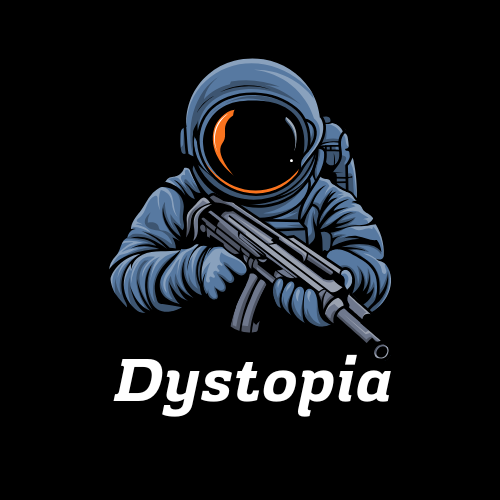

# Dystopia



## Description
Dystopia is a 2D platformer game set in a bleak post-apocalyptic world. Navigate through the ruins of a once-thriving urban landscape, overcome obstacles, and survive in this challenging environment.

## Screenshots


## Features
- Fluid character movement with animations
- Platform-based level design
- Custom collision detection system
- Start screen with menu navigation
- Responsive controls

## Installation

### Prerequisites
- Python 3.7+
- Pygame

### Setup
1. Clone the repository
```bash
git clone https://github.com/yourusername/dystopia.git
cd dystopia
```

2. Install required packages
```bash
pip install pygame
```

3. Run the game
```bash
python main.py
```

## Controls
- **Left Arrow/A**: Move left
- **Right Arrow/D**: Move right
- **Up Arrow/W/Space**: Jump
- **ESC**: Return to menu

## Development
Dystopia is currently in alpha (v0.1). Planned features include:
- Multiple levels with increasing difficulty
- Enemy AI and combat system
- Collectible items and power-ups
- More environmental hazards
- Story-driven gameplay elements
- Sound effects and music

## Contributing
Contributions are welcome! Please feel free to submit a Pull Request.

1. Fork the repository
2. Create your feature branch (`git checkout -b feature/amazing-feature`)
3. Commit your changes (`git commit -m 'Add some amazing feature'`)
4. Push to the branch (`git push origin feature/amazing-feature`)
5. Open a Pull Request

## License
MIT

## Acknowledgments
- Made using Pygame

---

Made with ❤️
